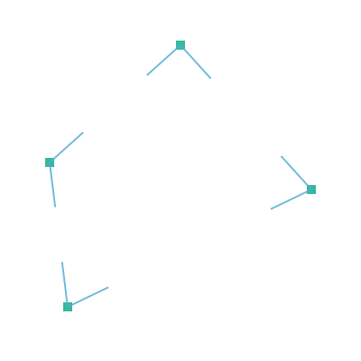
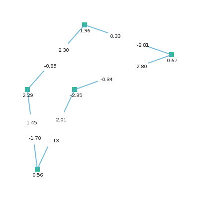
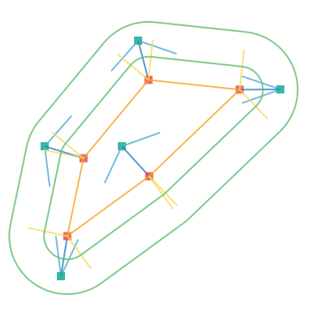
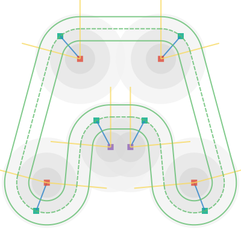

# xroads-game

I have always been addicted to these:


So let's paint some roads using the Haskell programming language.

## Red Dots

A point is represented by the data type `Point`. We create a list of some example points.

```haskell
data Point = Point Double Double
points = [Point 200 100, Point 100 300, Point 300 200]
```

We fill the canvas by white and draw each point by the functions `drawMarkerAt` and `drawOneMarker`.

```haskell
drawOneMarker bw (r,g,b) = do
  rectangle (-0.5*bw) (-0.5*bw) bw bw
  setSourceRGBA r g b 0.8
  fill

drawMarkerAt (Point x y) = do
  save
  translate x y
  drawOneMarker 20.0 red
  restore

paintCanvas = do
  setSourceRGB 1 1 1
  paint
  mapM_ drawMarkerAt points
```

The result is an image surface of size 400x400px, which we write to a file.

```haskell
createPng fileName = do
  let w = 400
      h = 400
  img <- createImageSurface FormatARGB32 w h
  renderWith img paintCanvas
  surfaceWriteToPNG img fileName

```

The full code for the red dots is here: [red-dots.hs](code/red-dots.hs)


## Orange Lines

To connect the points, we define the data type for vector. The colors are represented as RGB or RGBA color.

```haskell
data Vector = Vector Double Double
data RGBA = RGB  Double Double Double
          | RGBA Double Double Double Double
```

The colors now become

```haskell
white  = RGBA 1.00 1.00 1.00 1.00
red    = RGB  0.88 0.29 0.22
orange = RGB  0.98 0.63 0.15
yellow = RGB  0.97 0.85 0.39
green  = RGB  0.38 0.74 0.43
darkGreen = RGB 0.00 0.66 0.52
```

We get the line segments and corresponding vectors by

```haskell
mkVector (Point x0 y0) (Point x1 y1) =
  Vector (x1 - x0) (y1 - y0)

points = [Point 200 100, Point 100 300, Point 300 200]
segments = zip points (tail (cycle points))
vectors = map (uncurry mkVector) segments
```

The function `uncurry` from Prelude is used to unzip the tuple made by `zip`. To draw one vector, we use

```haskell
drawVector (Point x y) (Vector dx dy) = do
  setColor orange
  moveTo x y
  relLineTo dx dy
  stroke
```

Again, we clear the canvas and paint the markers and vectors connecting them.

```haskell
paintCanvas = do
  setSourceRGB 1 1 1
  paint
  mapM_ drawMarkerAt points
  mapM_ (uncurry drawVector) (zip points vectors)
```

The full code for the orange lines: [orange-lines.hs](code/orange-lines.hs)


## Yellow Normals

Next we find out the normals for each start point and end point. When the points are ordered counterclockwise, we get the outside pointing normal for a vector by

```haskell
normal (Vector dx dy) = 
  Vector (-dy) dx
```

We need the magnitude of the vector, so we can draw a multitude of its unit vector.

```haskell
dist (Point x0 y0) (Point x1 y1) = 
  sqrt ((sqr dx) + (sqr dy))
  where
    sqr x = x * x
    dx = x1 - x0
    dy = y1 - y0

magnitude (Vector dx dy) =
  dist (Point 0 0) (Point dx dy)

unit r (Vector dx dy) = 
  Vector (r * dx / mag) (r * dy / mag)
  where
    mag = magnitude (Vector dx dy)
```

Besides points and segments, we now get the start points, end points, vectors between them and the unit normals:

```haskell
points = [Point 200 100, Point 100 300, Point 300 200]
segments = zip points (tail (cycle points))
startPoints = map fst segments
endPoints = map snd segments
vectors = map (uncurry mkVector) segments
normals = map normal vectors
units = map (unit 1.0) normals
```

We stroke the normals in a loop

```haskell
paintCanvas = do
  setSourceRGB 1 1 1
  paint
  mapM_ drawMarkerAt points
  mapM_ (uncurry (drawVector orange)) (zip points vectors)
  mapM_ (uncurry (drawVector yellow)) (zip startPoints units)
  mapM_ (uncurry (drawVector yellow)) (zip endPoints units)
```

The full code for the normals: [yellow-normals.hs](code/yellow-normals.hs)


## Green Roads

The roadline is drawn using functions `drawLine` and `drawArc`. Function `drawLine` is used on straight paths and function `drawArc` on curves.

```haskell
paintRoadLine r = do
  mapM_ (uncurry (drawLine green)) (zip rStart rEnd)
  mapM_ (uncurry3 (drawArc green r)) arcs2
  where
    rVec = map (unit r) normals
    rStart = map (uncurry toPoint) (zip startPoints rVec)
    rEnd = map (uncurry toPoint) (zip endPoints rVec)
```

We take some measurements from the Lego-plates

```haskell
plateW = 100
roadMarks = [0.286, 0.307, 0.491]
r1 = plateW * roadMarks !! 0
r2 = plateW - r1
```

For an arc we need its center point, radius, start angle and end angle

```haskell
drawArc color r (Point x y) angle1 angle2 = do
  setColor color
  arc x y r angle1 angle2
  stroke
```

To get the calculations correct, we use `testPolygon` and `testDodecagon` as shape. For clarity the number `tau = 6.28318530717958647692` is used instead of `pi`.

```haskell
testPolygon = [Point 200 100, Point 100 200, Point 100 300, Point 300 200]
testDodecagon = 
  [Point (200 + radius * cos a)(200 - radius * sin a)| a <- angles]
  where
   radius = 100
   corners = 12
   angles = [i * (tau/corners) | i <- [0..corners-1]]
```


Given the vector, vectorangle can be calculated as follows:

```haskell
vectorAngle (Vector x y) 
  | y >= 0   = acos x
  | otherwise = -(acos x)
```

This is used to get the start angle and end angle of the arc. The function `drawArc` takes the center point, start angle and end angle as parameters. We have zipped them to a triple by the function `zip3` so we need the function `uncurry3` to unzip the parameters.

```haskell
uncurry3 f (a,b,c) = f a b c
```

The full code for the green roads: [green-roads.hs](code/green-roads.hs)


## Dark Green Points

Our initial purpose was to paint a road which goes through a set of given points. Let's get back to this purpose, and define the actual points:

```haskell
darkPoly = [Point 200 50, Point 55 180, Point 75 340, Point 345 210]
```


The simplified code looks now like: [dark-green-points.hs](code/dark-green-points.hs)

## Blue Vectors

To get the curves go through the points, we need to find the center point for the arc, that formes the curve. It probably is somewhere along the half of the angles between the defining points. Let's first find the angles.

```haskell
points = darkPoly
dirTriplets = transpose [rotList r points | r <- [-1,0,1]]
dirVecs2 = map (\[a,b,c] -> [(b,mkVector b a),(b,mkVector b c)]) dirTriplets
dirVecs = concat dirVecs2
dirUnits50 = map (\(s,v) -> (s, unit 50 v)) dirVecs
```

The function `transpose` from the module `Data.List` works with lists as follows:

```haskell
import Data.List
transpose ["ABCD","abcd","1234"]
 ⇒ ["Aa1","Bb2","Cc3","Dd4"]
```

We define the function `rotList` to rotate a list. We use this to get nicely the triplets of previous, current and next point.

```haskell
rotList n xs = take size (drop (n `mod` size) (cycle xs))
  where size = length xs
```

Now

```haskell
rotList (-1) "ABCDE" ⇒ "EABCD"
rotList 0 "ABCDE" ⇒ "ABCDE"
rotList 1 "ABCDE" ⇒ "BCDEA"

map (\n -> rotList n "ABCDE") [-1,0,1]
 ⇒ ["EABCD","ABCDE","BCDEA"]
```



The full code to find the directed vectors: [blue-vectors.hs](code/blue-vectors.hs)

## Dark Blue Halves

The angle between two vectors can be calculatated by the function `acos`, but there is an another more useful function `atan2` for the same purpose. It gives angles inside full turn without conditioning.

```haskell
axisX = Vector 1.0 0.0

vectorAngle (Vector x1 y1) (Vector x2 y2) =
  atan2 (x1*y2 - y1*x2) (x1*x2 + y1*y2)
```

Using this definition, we find the angle between vector and X-axis using the function `(vectorAngle axisX)`

```haskell
dirAngles = map (vectorAngle axisX) dirUnits
```



Everything seems to be upside-down because the coordinate origo situates in upper-left corner. We'll just ignore this. The angle of the fourth point gives us a negative number, because the actual angle is on the opposite side, but we can find use for this observation later.

The source code for this: [blue-atan2.hs](code/blue-atan2.hs)

## Back to Road

The half angles become thus the first of `dirAngles` added to the half of the `dirBetween`

```haskell
dirHalves = map 
  (\(a,b) -> b + 0.5*a) 
  (zip dirBetween (pairwise (\a b -> a) dirAngles))
```

We go half of the plate width to the direction of half angle, and convert the vector arrow to a point. 

```haskell
dirHVecs = map (vectorFromAngle (0.5*plateW)) dirHalves
points = map (uncurry toPoint) (zip darkPoly dirHVecs)
```

Now we have recalculated the original Red Points and can bring the road back.



We observe how our road became smarter than us. This is of course wrong...

The code: [back-to-road](code/back-to-road.hs)

## Distinguish Convex and Concave

Curves on road are either convex or concave. We represent this by data type `Curving`:

```haskell
data Curving = Convex | Concave
```

We know from earlier, that curve is convex, when (following the path counterclockwise) it's angle remains on the upper half of unit circle. There the function `vectorAngle` returns a positive number:

```haskell
curved angle 
 | angle >= 0  = Convex
 | otherwise   = Concave
```

Having made the definitions

```haskell
dirBetween = pairwise vectorAngle dirUnits
dirCurved  = map curved dirBetween
```

we get

```haskell
dirBetween = 
[1.707862501105084,0.45093642923738,-2.158798930342464,
-2.158798930342464,0.45093642923738, 1.707862501105084]
dirCurved = [Convex,Convex,Concave,Concave,Convex,Convex]
```

The orientation of straight road segment can be concluded from the convexity of its start and end point. The orientation of arc can be concluded from the convexity of previous, current and next point. Because the list of convexity becomes quite long, we abbreviate convex turn as `x` and concave turn as `o`:

```haskell
ox Convex  = 'x'
ox Concave = 'o'
```

With the given six points, we thus get

```haskell
dirOx = map ox dirCurved
 ⇒ "xxooxx"
```

From this, ge get the cycled pairs and cycled triples:

```haskell
dirCycledPairs = cycledPairs dirOx
dirCycledTriples = cycledTriples dirOx

cycledTriples xs = 
  zipWith3 (\a b c -> a:b:[c]) (rotList (-1) xs) xs (rotList 1 xs)
cycledPairs xs = zipWith (\a b -> a:[b]) xs (rotList 1 xs)
pairwise f (x:y:zs) = f x y : pairwise f zs
pairwise f _ = []
rotList n xs = take size (drop (n `mod` size) (cycle xs))
  where size = length xs
```

We get

```haskell
dirOx = "xxooxx"
dirCycledPairs = ["xx","xo","oo","ox","xx","xx"]
dirCycledTriples = ["xxx","xxo","xoo","oox","oxx","xxx"]
```

We use the triplets as parameters when calculating the new normals. The incoming normal gets all the needed information of convexity from the first two letters of a triplet and the outgoing from the last two. For this we use the functions `init` and `tail`.

```haskell
init "xox" ⇒ "xo"
tail "xox" ⇒ "ox"
```

## New normals

We use the convexity, coordinates and some old normals to calculate the new normals, which are a bit more correct than the old ones.

```haskell
calcVecs curves points units =
  map (uncurry3 calcVec) z
  where
  z = zip3 
    (cycledTriples (map ox curves))
    (cycledTriples points)
    (cycledTriples vecAngles)
```

Each point has two normals, the incoming `prevNew` and the outgoing `nextNew`. We create them as a pair `[prevNew,nextNew]`. In every case the start point of the vector is the original point `thisPt`. In convex case `"xx"` the normal goes to the direction of already calculated normal, having the angle `prevAg`. The same is true for concave case `"oo"`, but the normal goes to opposite direction.

```haskell
calcVec crv pts ags =
  [prevNew,nextNew] 
  where
    prevNew = case prevOx of
      "xx" -> Vec thisPt prevAg
      "oo" -> Vec thisPt (opposite prevAg)
      "xo" -> Vec thisPt (opposite (angleRS prevPt thisPt (+)))
      "ox" -> Vec thisPt (opposite (angleRS prevPt thisPt (-)))
      _    -> None
    nextNew = case nextOx of
      "xx" -> Vec thisPt thisAg
      "oo" -> Vec thisPt (opposite thisAg)
      "xo" -> Vec thisPt (angleRS thisPt nextPt (+))
      "ox" -> Vec thisPt (angleRS thisPt nextPt (-))
      _    -> None
    [prevOx,nextOx] = [init crv, tail crv]
    [prevPt,thisPt,nextPt] = pts
    [prevAg,thisAg,nextAg] = ags

opposite angle = (angle + 0.5*tau) `mod'` tau
```

When the segment has odd convexity, we need to use some trigonometry. This is done in function `angleRS`.

```haskell
angleRS p0 p1 op = 
  (beta `op` alpha) `mod'` tau
  where
    r = dist p0 p1
    alpha = acos (plateW / r)
    beta = vectorAngle axisX (mkVector p0 p1) 
```

In each case we draw the vectors with the function `drawVec`, which we define as

```haskell
drawVec (Vec pt ag) =
  drawVector yellow pt (vectorFromAngle plateW ag)
drawVec None = return ()

drawVecs xs = mapM_ drawVec xs
```


The data type `Vec` represents a vector with start point and a direction. We give us a liberty to define non-existing vectors using the constructor `None`.

```haskell
type Angle = Double
data Vec = Vec Point Angle | None
```

The code for this: [io-vecs.hs](code/io-vecs.hs)

## Painting the segments

Where the roadline crosses the normal, is desided based on the convexity of point. The `ratio` of `0.00` situates at the start point of the normal and the `ratio` of `1.00` at the head of the normal with length `PlateW`.

```haskell
alongAngle ratio angle curved =
  case curved of
    'x' -> vectorFromAngle (ratio*plateW) angle
    'o' -> vectorFromAngle ((1.00-ratio)*plateW) angle
```

Each segment is either a `Curve` or a `Straight`.

```haskell
type Curv = Char
data Segment = Straight Point Angle Curv Point Angle Curv
             | Curve Point Angle Angle Curv
```

We draw the segments accordingly in one of the following functions:

```haskell
drawSeg ratio (Curve p0 a0 a1 curved)
drawSeg ratio (Straight p0 a0 c0 p1 a1 c1)
```

A convex arc is drawn by the function `drawArcNegative` and a concave arc by the function `drawArc`.

```haskell
drawSeg ratio (Curve p0 a0 a1 curved) =
  case curved of
    'x' -> drawArcNegative green (ratio*plateW) p0 a0 a1
    'o' -> drawArc green ((1.00-ratio)*plateW) p0 a0 a1
```

A straight segment is drawn by the function `drawVector`, and we get its start and end points by function `alongAngle` defined earlier.

```haskell
drawSeg ratio (Straight p0 a0 c0 p1 a1 c1) = 
  drawVector green point0 (mkVector point0 point1)
  where
    point0 = toPoint p0 (alongAngle ratio a0 c0)
    point1 = toPoint p1 (alongAngle ratio a1 c1)
```

We draw a solid line at the ratios of `0.30` and `0.70` and the dashed line in middle at `0.50`. The dashed line may still need refinement.

```haskell
drawSeg1 x = do
  setDash [] 0
  mapM_ (\r -> drawSeg r x) [0.30,0.70]
  setDash [7,2] 0
  drawSeg 0.50 x
drawSegs xs = mapM_ drawSeg1 xs
```



The code: [io-segs.hs](code/io-segs.hs)

