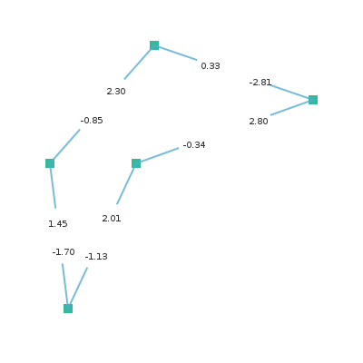

# xroads-game

I have always been addicted to these:


So let's paint some roads using the Haskell programming language.

## Red Dots

A point is represented by the data type `Point`. We create a list of some example points.

```
data Point = Point Double Double
points = [Point 200 100, Point 100 300, Point 300 200]
```

We fill the canvas by white and draw each point by the functions `drawMarkerAt` and `drawOneMarker`.

```
drawOneMarker bw (r,g,b) = do
  rectangle (-0.5*bw) (-0.5*bw) bw bw
  setSourceRGBA r g b 0.8
  fill

drawMarkerAt (Point x y) = do
  save
  translate x y
  drawOneMarker 20.0 red
  restore

paintCanvas = do
  setSourceRGB 1 1 1
  paint
  mapM_ drawMarkerAt points
```

The result is an image surface of size 400x400px, which we write to a file.

```
createPng fileName = do
  let w = 400
      h = 400
  img <- createImageSurface FormatARGB32 w h
  renderWith img paintCanvas
  surfaceWriteToPNG img fileName

```

The full code for the red dots is here: [red-dots.hs](code/red-dots.hs)


## Orange Lines

To connect the points, we define the data type for vector. The colors are represented as RGB or RGBA color.

```
data Vector = Vector Double Double
data RGBA = RGB  Double Double Double
          | RGBA Double Double Double Double
```

The colors now become

```
white  = RGBA 1.00 1.00 1.00 1.00
red    = RGB  0.88 0.29 0.22
orange = RGB  0.98 0.63 0.15
yellow = RGB  0.97 0.85 0.39
green  = RGB  0.38 0.74 0.43
darkGreen = RGB 0.00 0.66 0.52
```

We get the line segments and corresponding vectors by

```
mkVector (Point x0 y0) (Point x1 y1) =
  Vector (x1 - x0) (y1 - y0)

points = [Point 200 100, Point 100 300, Point 300 200]
segments = zip points (tail (cycle points))
vectors = map (uncurry mkVector) segments
```

The function `uncurry` from Prelude is used to unzip the tuple made by `zip`. To draw one vector, we use

```
drawVector (Point x y) (Vector dx dy) = do
  setColor orange
  moveTo x y
  relLineTo dx dy
  stroke
```

Again, we clear the canvas and paint the markers and vectors connecting them.

```
paintCanvas = do
  setSourceRGB 1 1 1
  paint
  mapM_ drawMarkerAt points
  mapM_ (uncurry drawVector) (zip points vectors)
```

The full code for the orange lines: [orange-lines.hs](code/orange-lines.hs)


## Yellow Normals

Next we find out the normals for each start point and end point. When the points are ordered counterclockwise, we get the outside pointing normal for a vector by

```
normal (Vector dx dy) = 
  Vector (-dy) dx
```

We need the magnitude of the vector, so we can draw a multitude of its unit vector.

```
dist (Point x0 y0) (Point x1 y1) = 
  sqrt ((sqr dx) + (sqr dy))
  where
    sqr x = x * x
    dx = x1 - x0
    dy = y1 - y0

magnitude (Vector dx dy) =
  dist (Point 0 0) (Point dx dy)

unit r (Vector dx dy) = 
  Vector (r * dx / mag) (r * dy / mag)
  where
    mag = magnitude (Vector dx dy)
```

Besides points and segments, we now get the start points, end points, vectors between them and the unit normals:

```
points = [Point 200 100, Point 100 300, Point 300 200]
segments = zip points (tail (cycle points))
startPoints = map fst segments
endPoints = map snd segments
vectors = map (uncurry mkVector) segments
normals = map normal vectors
units = map (unit 1.0) normals
```

We stroke the normals in a loop

```
paintCanvas = do
  setSourceRGB 1 1 1
  paint
  mapM_ drawMarkerAt points
  mapM_ (uncurry (drawVector orange)) (zip points vectors)
  mapM_ (uncurry (drawVector yellow)) (zip startPoints units)
  mapM_ (uncurry (drawVector yellow)) (zip endPoints units)
```

The full code for the normals: [yellow-normals.hs](code/yellow-normals.hs)


## Green Roads

The roadline is drawn using functions `drawLine` and `drawArc`. Function `drawLine` is used on straight paths and function `drawArc` on curves.

```
paintRoadLine r = do
  mapM_ (uncurry (drawLine green)) (zip rStart rEnd)
  mapM_ (uncurry3 (drawArc green r)) arcs2
  where
    rVec = map (unit r) normals
    rStart = map (uncurry toPoint) (zip startPoints rVec)
    rEnd = map (uncurry toPoint) (zip endPoints rVec)
```

We take some measurements from the Lego-plates

```
plateW = 100
roadMarks = [0.286, 0.307, 0.491]
r1 = plateW * roadMarks !! 0
r2 = plateW - r1
```

For an arc we need its center point, radius, start angle and end angle

```
drawArc color r (Point x y) angle1 angle2 = do
  setColor color
  arc x y r angle1 angle2
  stroke
```

To get the calculations correct, we use `testPolygon` and `testDodecagon` as shape. For clarity the number `tau = 6.28318530717958647692` is used instead of `pi`.

```haskell
testPolygon = [Point 200 100, Point 100 200, Point 100 300, Point 300 200]
testDodecagon = 
  [Point (200 + radius * cos a)(200 - radius * sin a)| a <- angles]
  where
   radius = 100
   corners = 12
   angles = [i * (tau/corners) | i <- [0..corners-1]]
```


Given the vector, vectorangle can be calculated as follows:

```
vectorAngle (Vector x y) 
  | y >= 0   = acos x
  | otherwise = -(acos x)
```

This is used to get the start angle and end angle of the arc. The function `drawArc` takes the center point, start angle and end angle as parameters. We have zipped them to a triple by the function `zip3` so we need the function `uncurry3` to unzip the parameters.

```
uncurry3 f (a,b,c) = f a b c
```

The full code for the green roads: [green-roads.hs](code/green-roads.hs)


## Dark Green Points

Our initial purpose was to paint a road which goes through a set of given points. Let's get back to this purpose, and define the actual points:

```
darkPoly = [Point 200 50, Point 55 180, Point 75 340, Point 345 210]
```


The simplified code looks now like: [dark-green-points.hs](code/dark-green-points.hs)

## Blue Vectors

To get the curves go through the points, we need to find the center point for the arc, that formes the curve. It probably is somewhere along the half of the angles between the defining points. Let's first find the angles.

```haskell
points = darkPoly
dirTriplets = transpose [rotList r points | r <- [-1,0,1]]
dirVecs2 = map (\[a,b,c] -> [(b,mkVector b a),(b,mkVector b c)]) dirTriplets
dirVecs = concat dirVecs2
dirUnits50 = map (\(s,v) -> (s, unit 50 v)) dirVecs
```

The function `transpose` from the module `Data.List` works with lists as follows:

```haskell
import Data.List
transpose ["ABCD","abcd","1234"]
 ⇒ ["Aa1","Bb2","Cc3","Dd4"]
```

We define the function `rotList` to rotate a list. We use this to get nicely the triplets of previous, current and next point.

```haskell
rotList n xs = take size (drop (n `mod` size) (cycle xs))
  where size = length xs
```

Now

```haskell
rotList (-1) "ABCDE" ⇒ "EABCD"
rotList 0 "ABCDE" ⇒ "ABCDE"
rotList 1 "ABCDE" ⇒ "BCDEA"

map (\n -> rotList n "ABCDE") [-1,0,1]
 ⇒ ["EABCD","ABCDE","BCDEA"]
```


The full code to find the directed vectors: [blue-vectors.hs](code/blue-vectors.hs)

## Dark Blue Halves

As we see in the product of [blue-angles-text.hs](code/blue-angles-text.hs)



the function `vectorAngle` defined as

```haskell
vectorAngle (Vector x y) 
  | y >= 0   = acos x
  | otherwise = -(acos x)
```

returns the angle between the vector and x-axis (coordinate origo being in left-upper corner).

Next time we'll try to find the half angle between those...
