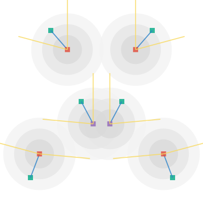

## Painting the segments


Each segment is either a `Curve` or a `Straight`.

```haskell
type Curv = Char
data Segment = Straight Point Angle Curv Point Angle Curv
             | Curve Point Angle Angle Curv
```


```haskell
```

```haskell
```

```haskell
```




The code: [io-vecs.hs](code/io-vecs.hs)


